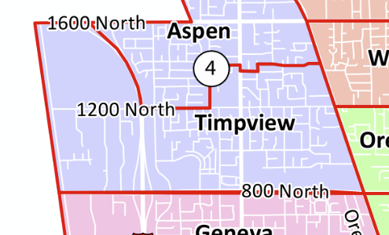

# Suggest a Guest

!!! tip "Contact Us"
    [timpviewvoices[at]gmail.com](mailto:timpviewvoices@gmail.com)

## :tada: Join Us

Our goal is **community**. We aren't tracking down heroes, celebrities, or subject-matter experts; we simply want to connect with our neighbors. Everyday conversations can unearth extraordinary stories and friendships. In that spirit, we aim for comfortable, lighthearted conversations with the fun neighbors that we used to interact with regularly.

The only criteria for being our guest is that you are somehow affiliated with the Timpview neighborhood of Orem. You don't have to currently live within the boundaries of the neighborhood. The boundaries can be seen below:

## :ballot_box: Nominate a neighbor

Like C.S. Lewis, we believe that **there are no ordinary people**.

So nominate a neighbor as our guest! Many remarkable people do not think they are worth highlighting when they really are. Let us know about those people, and we will get in touch with them.

## :studio_microphone: What to Expect as a Guest

We will send the guest an invitation by email that explains the purpose of the podcast. They will receive a link to an online calendaring website, where they can schedule a virtual meeting time.

The guest needs:

* A basic working microphone
* Zoom software installed on a computer or mobile phone

We don’t take ourselves too seriously; we haven’t bought expensive recording hardware or post-processing software. We expect the podcast to only circulate within this neighborhood.

For each episode, we use Zoom to record a 15 to 30 minute conversation. We are currently posting audio recordings only, but we may consider video in the future. We are happy to do some basic editing to help the guest sound as good as possible. If wanted, we can provide a list of general questions ahead of time.
