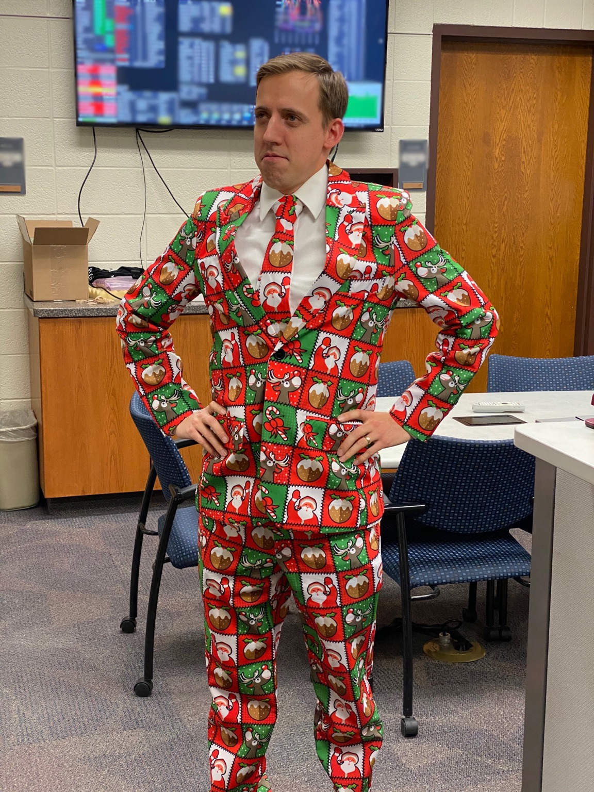

# Billy Wilson

{: .center style="width:450px"}

!!! summary "Bio"
    Billy Wilson grew up in Northern California. He served an ecclesiastical mission in South Korea for two years and submitted an application to Brigham Young University on a whim. They fortunately ignored his atrocious high school transcripts and let him in based on a good year of junior college. He met the love of his life, Hallie, while attending BYU. They now live in the Timpview Neighborhood and have five children.

    Billy takes care of a supercomputer for his day job, but if every job paid the same (and talent didn't matter), he would be a writer.
