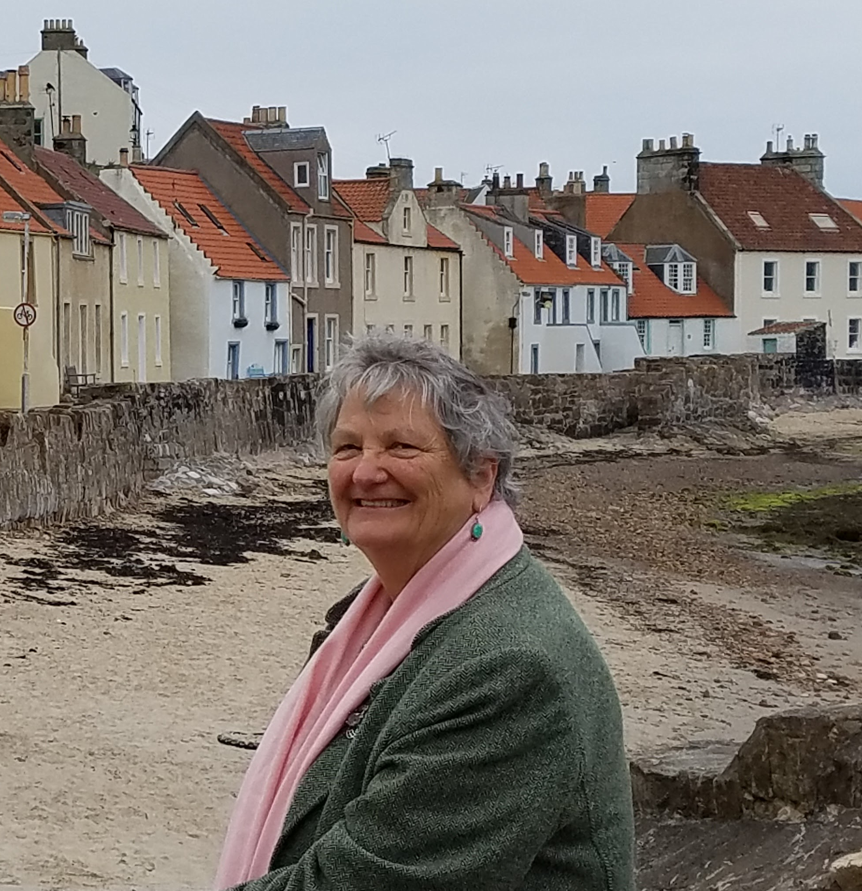

# Karen Pierotti

{: .center style="width:450px"}

!!! summary "Bio"
    Karen Edwards Pierotti was born in Edinburgh, Scotland to a Welsh father and a Scots mother. As her father was in the Royal Air Force (RAF) she moved a lot, living in various places in England, Scotland and Wales as well as Gibraltar. As an adult, she spent a year working for a Swiss travel agent in Lugano, Switzerland.
    
    After joining the Church of Jesus Christ of Latter-day Saints, she came to BYU and completed a BA in English and a MA in rhetoric. She worked at BYU for 29 years and, after her MA, taught first-year writing part-time, keeping her day job of administrative assistant in Undergraduate Education (GE and Honors programs).
    
    She likes to garden and by default has created an English garden in hot-weather Utah; cook food from various countries, especially European and Indian; has hosted dancers from the Springville Folk Festival and had several exchange students to give her children exposure to other cultures; and likes to travel visiting many countries in Europe (bicycling around the Netherlands and Denmark were two memorable holidays). She likes doing family history. Currently her main activity is writing historical fiction which means going down rabbit-holes of research, meeting with critique groups, and attending writing conferences and, once in a while, self-publishing a book.

    Karen has lived in the Timpview neighborhood for 41 years. She is a widow of 28 years and has four children and six grandchildren who live in Virginia, Washington state, and Utah. She and her husband, Peter, enjoyed raising their children here and receiving the support and love of neighbors through good times and bad. It’s a wonderful place to live because of the kind, caring people who live here. 

!!! tip ":electric_plug: Shameless Plug"

    Visit Karen's website to learn more about her historical novels: [karenmedwards.com](https://www.karenmedwards.com/)

