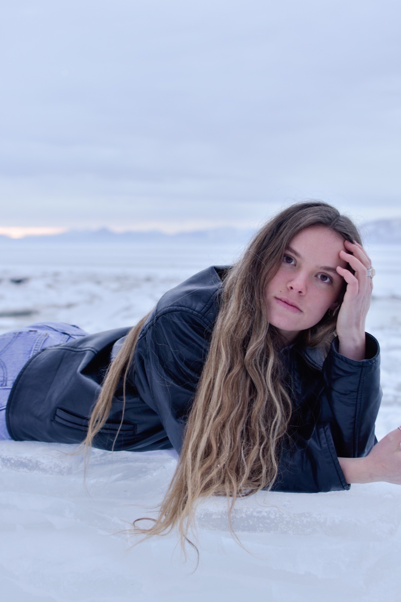

# Mary Bekker

{: .center style="width:450px"}

!!! summary "Bio"
    Mary has lived in the Timpview neighborhood her entire life. She is a sophomore at BYU Hawaii studying cultural anthropology, film, entrepreneurship, and health and human performance. She works as a lift operator at Sundance Mountain Resort and loves exercising, being outdoors, traveling, and trying new things.
